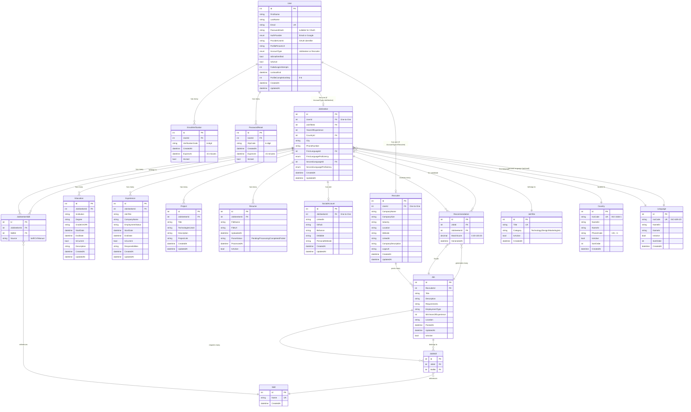

# Entity Relationship Diagram (ERD)
## JobIntel Recruitment Platform Database Schema

This document contains the ERD for the JobIntel Recruitment Platform database.

---

## Database Overview

**Total Tables:** 19
- **Core Entities:** 3 (User, JobSeeker, Recruiter)
- **Profile Data:** 6 (Education, Experience, Project, Resume, SocialAccount, Skill)
- **Job Management:** 2 (Job, Recommendation)
- **Reference/Lookup:** 3 (Country, Language, JobTitle)
- **Many-to-Many Junctions:** 2 (JobSeekerSkill, JobSkill)
- **Auth/Security:** 2 (EmailVerification, PasswordReset)

---

## ERD Diagram (Mermaid Format)



---

## Relationship Details

### One-to-One Relationships
1. **User → JobSeeker** (Conditional: when AccountType = JobSeeker)
2. **User → Recruiter** (Conditional: when AccountType = Recruiter)
3. **JobSeeker → SocialAccount** (One job seeker has one social account)

### One-to-Many Relationships

#### User Relationships
- User → EmailVerification (1:N)
- User → PasswordReset (1:N)

#### JobSeeker Relationships
- JobSeeker → Education (1:N)
- JobSeeker → Experience (1:N)
- JobSeeker → Project (1:N)
- JobSeeker → Resume (1:N)
- JobSeeker → JobSeekerSkill (1:N)
- JobSeeker → Recommendation (1:N)

#### Reference Data Relationships
- JobTitle → JobSeeker (1:N)
- Country → JobSeeker (1:N)
- Language → JobSeeker as FirstLanguage (1:N)
- Language → JobSeeker as SecondLanguage (1:N)

#### Recruiter Relationships
- Recruiter → Job (1:N)

#### Job Relationships
- Job → JobSkill (1:N)
- Job → Recommendation (1:N)

### Many-to-Many Relationships

1. **JobSeeker ↔ Skill** (via JobSeekerSkill junction table)
   - A job seeker can have multiple skills
   - A skill can belong to multiple job seekers

2. **Job ↔ Skill** (via JobSkill junction table)
   - A job can require multiple skills
   - A skill can be required by multiple jobs

3. **Job ↔ JobSeeker** (via Recommendation junction table)
   - A job can be recommended to multiple job seekers
   - A job seeker can receive recommendations for multiple jobs
   - Contains computed MatchScore attribute

---

## Key Features & Constraints

### Authentication System
- **Multi-Provider Auth:** Supports Email and Google OAuth
- **Email Verification:** 6-digit OTP with 15-minute expiration
- **Password Reset:** Secure OTP-based password recovery
- **Account Lockout:** 5 failed attempts trigger 30-minute lockout

### Profile System
- **Wizard-Based Completion:** 6-step progressive profile building
  - Step 0: Not Started
  - Step 1: Personal Information
  - Step 2: Projects
  - Step 3: CV Upload
  - Step 4: Experience
  - Step 5: Education
  - Step 6: Social Links (Complete)

### Localization Support
- **Bilingual Reference Data:** Country, Language tables have English and Arabic names
- **Client-Side Selection:** Frontend sends preferred language (en/ar) in API requests
- **Dynamic Response:** API returns localized field names based on language parameter

### Data Integrity
- **Unique Constraints:**
  - User.Email (unique, case-insensitive)
  - Country.IsoCode
  - Language.IsoCode
  - JobTitle.Title
  - Skill.Name

- **Required Fields:** All foreign keys and core attributes are non-nullable
- **Optional Fields:** Profile completion allows progressive data entry

### Soft Deletes
- Resume.IsActive (allows multiple CV versions, only one active)
- Job.IsActive (archive jobs without deletion)
- Reference tables (Country, Language, JobTitle) have IsActive flags

---

## Database Seeding

### Initial Reference Data
- **Countries:** 65 countries with localized names (Egypt prioritized)
- **Languages:** 50 languages with ISO codes and localized names
- **Job Titles:** 90 titles across 8 categories
  - Technology (30)
  - Design (10)
  - Marketing (10)
  - Sales (10)
  - Finance (10)
  - Human Resources (5)
  - Operations (10)
  - Executive (5)

---

## Indexes & Performance

### Recommended Indexes (for production)
```sql
-- Authentication lookups
CREATE INDEX IX_Users_Email ON Users(Email);
CREATE INDEX IX_Users_ProviderUserId ON Users(ProviderUserId);
CREATE INDEX IX_EmailVerifications_UserId ON EmailVerifications(UserId);
CREATE INDEX IX_PasswordResets_UserId_ExpiresAt ON PasswordResets(UserId, ExpiresAt);

-- Profile queries
CREATE INDEX IX_JobSeekers_UserId ON JobSeekers(UserId);
CREATE INDEX IX_Recruiters_UserId ON Recruiters(UserId);
CREATE INDEX IX_JobSeekers_CountryId ON JobSeekers(CountryId);
CREATE INDEX IX_JobSeekers_JobTitleId ON JobSeekers(JobTitleId);

-- Job searches
CREATE INDEX IX_Jobs_RecruiterId_IsActive ON Jobs(RecruiterId, IsActive);
CREATE INDEX IX_Jobs_PostedAt_IsActive ON Jobs(PostedAt, IsActive);

-- Recommendation system
CREATE INDEX IX_Recommendations_JobSeekerId_MatchScore ON Recommendations(JobSeekerId, MatchScore DESC);
CREATE INDEX IX_Recommendations_JobId_MatchScore ON Recommendations(JobId, MatchScore DESC);

-- Skills matching
CREATE INDEX IX_JobSeekerSkills_JobSeekerId ON JobSeekerSkills(JobSeekerId);
CREATE INDEX IX_JobSeekerSkills_SkillId ON JobSeekerSkills(SkillId);
CREATE INDEX IX_JobSkills_JobId ON JobSkills(JobId);
CREATE INDEX IX_JobSkills_SkillId ON JobSkills(SkillId);
```

---

## Technology Stack

- **Framework:** ASP.NET Core 9.0
- **ORM:** Entity Framework Core 9.0.10
- **Database:** SQL Server (LocalDB for dev)
- **Migrations:** Single consolidated InitialCreate migration
- **Seed Data:** Loaded via EF Core migration

---

## Notes for Graduation Documentation

1. **Normalization Level:** Database follows 3NF (Third Normal Form)
   - No transitive dependencies
   - All non-key attributes depend on primary key
   - Many-to-many relationships properly decomposed with junction tables

2. **Scalability Considerations:**
   - User-AgnosticProfile separation (User vs JobSeeker/Recruiter)
   - Reference data tables prevent redundancy
   - Junction tables enable efficient many-to-many queries
   - Soft deletes preserve historical data

3. **Security Features:**
   - Password hashing (never store plain text)
   - OTP expiration for time-limited operations
   - Account lockout mechanism
   - OAuth integration for third-party authentication

4. **Business Logic:**
   - Match scoring system for recommendations
   - Progressive profile completion wizard
   - Multi-language support for international audience
   - Role-based access (JobSeeker vs Recruiter)

---

## How to Export This Diagram

### Option 1: Render Mermaid Diagram Online
1. Copy the mermaid code block above
2. Go to https://mermaid.live/
3. Paste the code
4. Export as PNG, SVG, or PDF

### Option 2: Use VS Code Extension
1. Install "Markdown Preview Mermaid Support" extension
2. Open this file in VS Code
3. Press `Ctrl+Shift+V` to preview
4. Right-click on diagram → "Copy as Image"

### Option 3: Use Draw.io / Lucidchart
1. Import the relationship details above
2. Create a visual ERD using their drag-and-drop interface
3. Export as high-resolution image

### Option 4: Use Database Tools
1. Open SQL Server Management Studio (SSMS)
2. Right-click database → "Diagrams" → "New Database Diagram"
3. Select all tables
4. Arrange and export

---

**Created for:** JobIntel Recruitment Platform  
**Date:** December 29, 2025  
**Database:** RecruitmentPlatformDb  
**Version:** 1.0  
