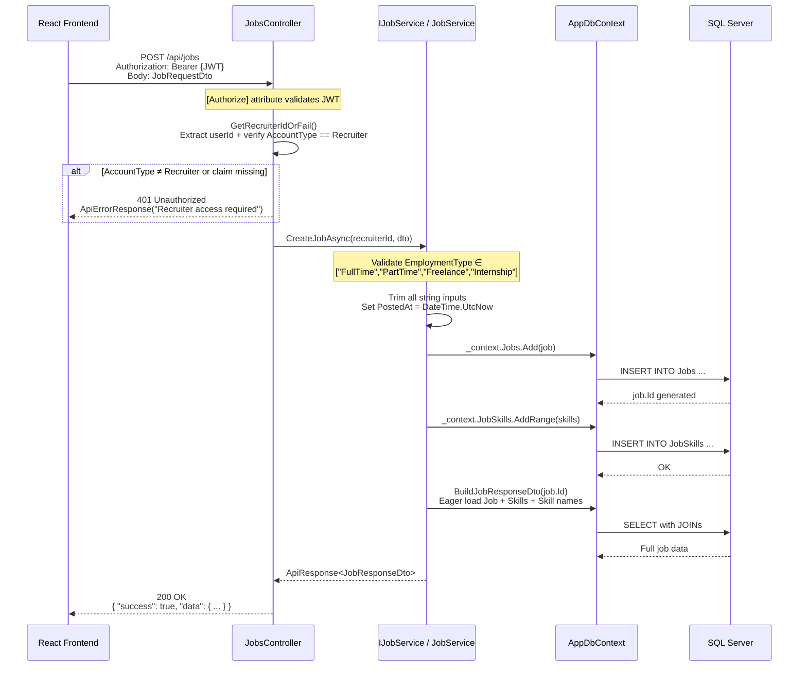
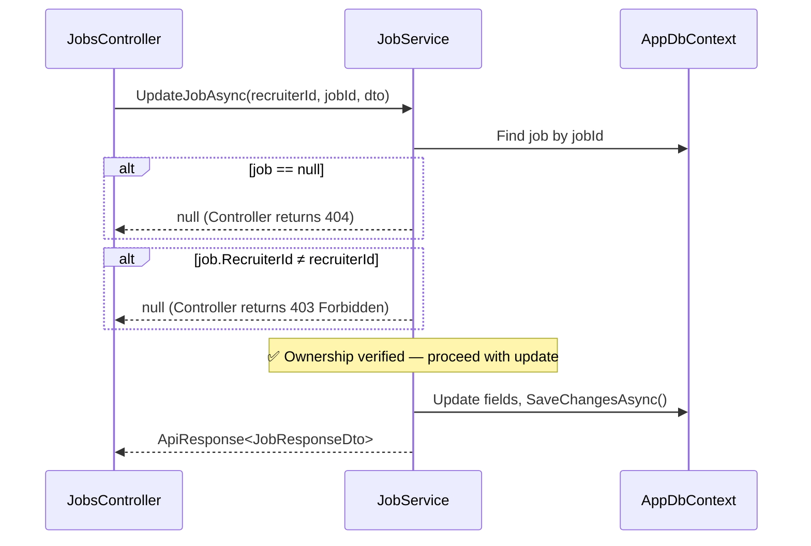

---
tags:
  - aspnet
  - webapi
  - graduation-project
  - recruitment
  - jobintel
  - dotnet9
  - entity-framework
  - jwt
  - n-tier
project: JobIntel Recruitment Platform
version: 1.6.0
framework: ASP.NET Core 9.0
last_updated: 2026-02-27
status: Active Development
---

# JobIntel — Project Context (Single Source of Truth)

> **Purpose of this document:** This file is the canonical reference for all future AI interactions, code generation, and development decisions on the JobIntel backend. Every coding pattern, convention, and architectural rule documented here is derived from direct analysis of the actual codebase.

---

## 1. Project Overview

**JobIntel** is a backend REST API for a recruitment platform that connects **Job Seekers** with **Recruiters** — essentially a LinkedIn-style backend built as a graduation project.

### Core Purpose

Provide a complete recruitment lifecycle API: authentication → profile building → job posting → AI-powered candidate matching.

### The Two User Types

| User Type | Profile Flow | Description |
|-----------|-------------|-------------|
| **Job Seeker** | 6-step wizard | Build a professional profile: personal info → projects → CV upload → experience → education → social links |
| **Recruiter** | 1-step wizard | Register a company: name, size, industry, location, description |

### Overall Goal

1. **Authentication** — Email/password + Google OAuth, email verification, password reset, account lockout
2. **Job Seeker Profile Wizard** — Multi-step completion with progress tracking
3. **Recruiter Profile** — Company info with industry and size
4. **Job Posting** — Recruiters create/manage jobs with required skills ✅
5. **AI-Powered Matching** — Match job seekers to jobs *(immediate next step)*
6. **Assessments, Notifications, Admin Panel** *(future)*

---

## 2. Architecture & Tech Stack

### Technology Stack

| Component | Technology | Version |
|-----------|-----------|---------|
| Framework | ASP.NET Core | 9.0 |
| Language | C# | 12.0 |
| ORM | Entity Framework Core | 9.0 |
| Database | SQL Server (LocalDB) | — |
| Authentication | JWT Bearer + Google OAuth 2.0 | — |
| Password Hashing | BCrypt.Net-Next | 4.0.3 |
| Email | MailKit (SMTP/Gmail) | 4.14.1 |
| API Docs | Swagger/Swashbuckle | — |

### N-Tier Architecture

The project follows a strict **Controller → Service Interface → Service Implementation → EF Core DbContext** layered architecture:

```
┌─────────────────────────────────────────────────┐
│                CLIENT (React)                   │
└──────────────────────┬──────────────────────────┘
                       │ HTTP + JWT Bearer Token
                       ▼
┌─────────────────────────────────────────────────┐
│              CONTROLLER LAYER                   │
│  • Receives HTTP requests                       │
│  • Extracts userId from JWT claims              │
│  • Validates model state ([ApiController])      │
│  • Returns ApiResponse<T> or ApiErrorResponse   │
└──────────────────────┬──────────────────────────┘
                       │ Method calls via interface
                       ▼
┌─────────────────────────────────────────────────┐
│               SERVICE LAYER                     │
│  • Business logic and validation                │
│  • Input trimming and sanitization              │
│  • Entity ↔ DTO mapping                        │
│  • Structured logging                           │
│  • try/catch error handling                     │
└──────────────────────┬──────────────────────────┘
                       │ EF Core queries
                       ▼
┌─────────────────────────────────────────────────┐
│            DATA LAYER (AppDbContext)             │
│  • DbSet<T> for each entity                    │
│  • Fluent API configurations                    │
│  • NO global query filters                      │
│  • NO SaveChangesAsync override                 │
└─────────────────────────────────────────────────┘
```

### Key Implementation Details

**JWT Claims Structure:**
```json
{
  "sub": "4",
  "email": "user@example.com",
  "name": "John Doe",
  "role": "Recruiter",
  "AccountType": "Recruiter",
  "FirstName": "John",
  "LastName": "Doe"
}
```

**`ApiResponse<T>` Wrapper** (all success responses):
```csharp
return Ok(new ApiResponse<JobResponseDto>(data));
```

**`ApiErrorResponse` Wrapper** (all error responses):
```csharp
return NotFound(new ApiErrorResponse("Job not found"));
return Unauthorized(new ApiErrorResponse("User not authenticated"));
```

**JSON Serialization** (configured globally in [`Program.cs`](RecruitmentPlatformAPI/Program.cs)):
- Property naming: **camelCase** (`JsonNamingPolicy.CamelCase`)
- Enums: serialize as **strings** (`JsonStringEnumConverter`)

---

## 3. Visual Architecture Diagram

### Standard N-Tier Request Flow: Recruiter Creating a Job



### Ownership Verification Flow (Update/Delete)



---

## 4. Entity Model Reference

### Database Overview

**19 tables** organized into six categories:

| Category | Tables |
|----------|--------|
| **Core Users** | `User`, `JobSeeker`, `Recruiter` |
| **Profile Data** | `Education`, `Experience`, `Project`, `Resume`, `SocialAccount`, `Skill` |
| **Job Management** | `Job`, `JobSkill`, `Recommendation` |
| **Reference/Lookup** | `Country`, `Language`, `JobTitle` (90 seeded titles) |
| **Junction Tables** | `JobSeekerSkill`, `JobSkill` |
| **Auth/Security** | `EmailVerification`, `PasswordReset` |

### Job Entity (Immediate Focus)

From [`Models/Jobs/Job.cs`](RecruitmentPlatformAPI/Models/Jobs/Job.cs):

```csharp
public class Job
{
    public int Id { get; set; }
    public int RecruiterId { get; set; }          // FK → Recruiter (ownership)
    public string Title { get; set; }              // max 150
    public string Description { get; set; }        // max 1200
    public string Requirements { get; set; }       // max 1200
    public EmploymentType EmploymentType { get; set; } // enum, stored as string in DB
    public int MinYearsOfExperience { get; set; }
    public string? Location { get; set; }          // max 100
    public DateTime PostedAt { get; set; }
    public DateTime UpdatedAt { get; set; }
    public bool IsActive { get; set; } = true;     // toggle, NOT soft delete
}
```

### Soft Delete vs. Hard Delete Matrix

| Entity | Delete Strategy | Fields |
|--------|----------------|--------|
| `Education`, `Experience`, `Project`, `Resume` | **Soft delete** (service-level) | `IsDeleted` + `DeletedAt` |
| **`Job`** | **Hard delete** (`_context.Jobs.Remove()`) | N/A |
| **`Job` deactivation** | **IsActive toggle** | `IsActive` flag |

> ⚠️ **Critical:** There is NO global query filter in `AppDbContext`. Every service must manually filter `!IsDeleted` where applicable. Jobs do NOT use soft delete — they use hard delete + IsActive toggle.

---

## 5. Strict Coding Guidelines

These 17 rules are derived from direct analysis of the codebase and the implementation guides. **All must be followed exactly when creating the Jobs module or any future module.**

### 5.1 Dependency Injection

| # | Rule | Detail |
|---|------|--------|
| 1 | **Register as `AddScoped`** | Add `builder.Services.AddScoped<IJobService, JobService>();` in [`Program.cs`](RecruitmentPlatformAPI/Program.cs) alongside existing registrations (line ~100). The `using RecruitmentPlatformAPI.Services.Recruiter;` import already exists. |

### 5.2 Controller Patterns

| # | Rule | Detail |
|---|------|--------|
| 2 | **No base controller** | There is no shared base controller. Each controller extends `ControllerBase` directly and duplicates helper methods inline. |
| 3 | **Controller decoration** | Every controller must have: `[ApiController]`, `[Route("api/...")]`, `[Produces("application/json")]`. |
| 4 | **`[Authorize]` placement** | Apply `[Authorize]` **per-action** (not class-level) when any endpoint needs `[AllowAnonymous]` (e.g., `GET /api/jobs/skills`). |
| 5 | **`GetRecruiterIdOrFail()` helper** | **Required for JobsController.** Must check both `ClaimTypes.NameIdentifier` AND `AccountType == Recruiter` claim. Returns `null` if either check fails: |

```csharp
private int? GetRecruiterIdOrFail()
{
    var userIdClaim = User.FindFirst(ClaimTypes.NameIdentifier)?.Value;
    var accountTypeClaim = User.FindFirst("AccountType")?.Value;
    if (userIdClaim == null || accountTypeClaim != AccountType.Recruiter.ToString())
        return null;
    return int.Parse(userIdClaim);
}
```

### 5.3 Service Layer Rules

| # | Rule | Detail |
|---|------|--------|
| 6 | **Constructor pattern** | Every service injects `AppDbContext` + `ILogger<T>` via constructor. No other pattern is used. |
| 7 | **Ownership guard** | **Always verify `job.RecruiterId == recruiterId`** before any update/delete/deactivate operation. |
| 8 | **`try/catch` in all methods** | Wrap all service methods in `try/catch`. Log exceptions with `_logger.LogError`. Return `null` or `false` on failure. |
| 9 | **Input trimming** | Always call `.Trim()` on required strings. Use `?.Trim()` for nullable/optional strings. |
| 10 | **`DateTime.UtcNow` always** | Never use `DateTime.Now`. All timestamps must be UTC. |
| 11 | **Structured logging** | Use named parameters: `_logger.LogInformation("Job {JobId} created by recruiter {RecruiterId}", job.Id, recruiterId)` |

### 5.4 Data & Validation Rules

| # | Rule | Detail |
|---|------|--------|
| 12 | **Employment type validation** | `EmploymentType` is a C# enum (`FullTime`, `PartTime`, `Freelance`, `Internship`). Serialized as strings via global `JsonStringEnumConverter`. Stored as string in DB via `.HasConversion<string>()`. |
| 13 | **Max 15 skills per job** | Enforce in DTO validation. |
| 14 | **Pagination clamping** | Always clamp: `Math.Max(1, page)` and `Math.Clamp(pageSize, 1, 50)`. |
| 15 | **No migration needed** | The `Jobs`, `JobSkills`, `Skills`, and `Recommendations` tables already exist in the database schema. This is pure code implementation. |

### 5.5 Response & Documentation

| # | Rule | Detail |
|---|------|--------|
| 16 | **Response wrappers** | Success → `ApiResponse<T>`. Error → `ApiErrorResponse`. No exceptions. Enums serialize as strings automatically (global config). |
| 17 | **XML doc comments** | All public DTOs, interface methods, and controller actions must have `/// <summary>` comments. The project has `<GenerateDocumentationFile>true</GenerateDocumentationFile>` enabled. |

### 5.6 Namespace Alias Convention

When a folder name collides with a class name, use a namespace alias:

```csharp
using JobSeekerEntity = RecruitmentPlatformAPI.Models.JobSeeker.JobSeeker;
```

This pattern is already used in [`ProjectService.cs`](RecruitmentPlatformAPI/Services/JobSeeker/ProjectService.cs) and must be replicated in `JobService` if needed.

---

## 6. Current Project Status (v1.6.0)

### ✅ Completed Modules

| Module | Endpoints | Notes |
|--------|-----------|-------|
| Authentication | 9 | Email/password, Google OAuth, email verification, password reset, account lockout |
| Job Seeker — Personal Info (Step 1) | 4 | Save/get info, wizard status, job titles list |
| Job Seeker — Projects (Step 2) | 4 | CRUD with auto-ordering and soft delete |
| Job Seeker — CV Upload (Step 3) | 2 | PDF upload/download with file validation |
| Job Seeker — Experience (Step 4) | 4 | CRUD with soft delete |
| Job Seeker — Education (Step 5) | 4 | CRUD with soft delete |
| Job Seeker — Social Links (Step 6) | 3 | Upsert/get/delete social accounts |
| Job Seeker — Profile Picture | 1 | Image upload |
| Recruiter Profile | 5 | Company info, wizard status, industries, company sizes |
| Reference Data | 2 | Countries, languages (bilingual EN/AR) |
| **Job Management** | **8** | **CRUD, skills, activate/deactivate, paginated list (Recruiter only)** |
| **Total** | **~46** | |

### 🔜 Immediate Next Step: AI-Powered Matching / Job Search

**Potential scope:**
- Public job browsing endpoints (Job Seekers view active jobs)
- Job search with filters (employment type, skills, location)
- AI-powered candidate ↔ job matching
- Job applications

### 📋 Future Modules (Not Started)

- AI-Powered Candidate Matching / Recommendations
- Assessment Quiz System
- CV Parsing (NLP)
- Notifications
- Admin Panel

---

## 7. Key File Reference

| File | Purpose |
|------|---------|
| [`Program.cs`](RecruitmentPlatformAPI/Program.cs) | DI registration, JWT config, CORS, JSON options, middleware pipeline |
| [`Data/AppDbContext.cs`](RecruitmentPlatformAPI/Data/AppDbContext.cs) | All DbSets, Fluent API config, seed data — NO global filters |
| [`Models/Jobs/Job.cs`](RecruitmentPlatformAPI/Models/Jobs/Job.cs) | Job entity with navigation properties |
| [`Enums/EmploymentType.cs`](RecruitmentPlatformAPI/Enums/EmploymentType.cs) | FullTime, PartTime, Freelance, Internship enum |
| [`DTOs/Recruiter/JobDtos.cs`](RecruitmentPlatformAPI/DTOs/Recruiter/JobDtos.cs) | Job request/response DTOs + SkillOptionDto |
| [`Services/Recruiter/IJobService.cs`](RecruitmentPlatformAPI/Services/Recruiter/IJobService.cs) | Job service interface (8 methods) |
| [`Services/Recruiter/JobService.cs`](RecruitmentPlatformAPI/Services/Recruiter/JobService.cs) | Job service implementation — CRUD, skills, ownership guard |
| [`Controllers/JobsController.cs`](RecruitmentPlatformAPI/Controllers/JobsController.cs) | Jobs API controller — 8 endpoints at `/api/jobs` |
| [`Data/Seed/SkillSeed.cs`](RecruitmentPlatformAPI/Data/Seed/SkillSeed.cs) | 50 seeded skills (programming, frameworks, databases, cloud, etc.) |
| [`Models/JobSeeker/Project.cs`](RecruitmentPlatformAPI/Models/JobSeeker/Project.cs) | Reference for soft-delete pattern |
| [`Services/JobSeeker/ProjectService.cs`](RecruitmentPlatformAPI/Services/JobSeeker/ProjectService.cs) | Reference for service patterns, try/catch, logging, trimming |
| [`Services/Recruiter/RecruiterService.cs`](RecruitmentPlatformAPI/Services/Recruiter/RecruiterService.cs) | Reference for recruiter-side service patterns |
| [`Controllers/JobSeekerController.cs`](RecruitmentPlatformAPI/Controllers/JobSeekerController.cs) | Reference for controller patterns, GetCurrentUserId() |
| [`DTOs/Common/`](RecruitmentPlatformAPI/DTOs/Common/) | `ApiResponse<T>` and `ApiErrorResponse` wrappers |
| [`Docs/Guides/JOBS_MODULE_IMPLEMENTATION_GUIDE.md`](Docs/Guides/JOBS_MODULE_IMPLEMENTATION_GUIDE.md) | Full implementation guide for Jobs module |
| [`Docs/Guides/JOBS_MODULE_QUICK_GUIDE.md`](Docs/Guides/JOBS_MODULE_QUICK_GUIDE.md) | Quick reference with copy-paste code |

---

*This document is the single source of truth for all JobIntel backend development. Update it when new modules are completed or conventions change.*